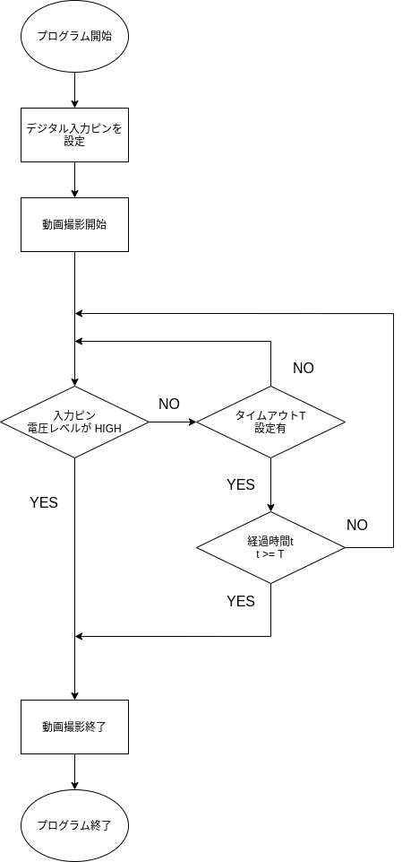

# CLI

picam には CLI アプリケーションも同梱されており，コマンドライン上でカメラに関するいくつかのコマンドを実行できます．以下では，そのコマンドについて説明します．

## プログラム起動前に

このプログラムでは GPIO ピンを扱うためのライブラリとして pigpio を使用しています．pigpio を利用する際は

```bash
$ sudo pigpiod
```

のように，デーモンを起動させておく必要があります．デーモンの起動は初めに一度だけ行えば大丈夫です．

## `python -m picam iorec` コマンド

以下の形式のコマンドを実行して，デジタル IO によって制御できるレコーダーを起動します：

```
python -m picam iorec [OPTIONS] PIN
```

プログラムの基本的なフローは下図のとおりです．タイムアウトなどはオプション引数を指定することで設定できます．



### PIN

この引数は監視するデジタル入力ピンを設定します．ピン番号の値は 0 ~ 26 のいずれかである必要があります．Raspberry Pi のピン番号の振り方は2通り存在しますが，ここでは BCM 番号を用います．

```
-- ピン番号を 25 にして起動
python -m picam iorec 25
```

### --timeout, -t

このオプションでは撮影のタイムアウトを設定できます．設定したタイムアウトの時間を超過すると，フライトカメラのプログラムは終了します．デフォルトではタイムアウトの設定はありません．

時間を数字のみで指定した場合は，単位は秒として解析されます:

```
-- タイムアウトを 10 分に設定して起動
python -m picam iorec -t 600
```

時間をより直感的に指定するために 'h', 'm', 's' の文字列を指定することも出来ます:

```
-- タイムアウトを 1時間半 に設定して起動
python -m picam iorec -t 1h30m
```

整数だけでなく，小数で指定することも可能です:

```
-- タイムアウトを 1時間半 に設定して起動 (小数)
python -m picam iorec -t 1.5h
```

また，末尾の "s" は省略可能です:

```
-- タイムアウトを 1分20秒 に設定して起動
python -m picam iorec -t 1m20
```
時間の単位を指定するためのアルファベットには大文字・小文字の区別はありません．

### --interval, -i

このオプションはデジタル入力ピンの電圧レベルを監視する時間間隔を指定します．デフォルトは 1秒 です．このオプションも "--timeout" オプションで使用できる時間フォーマットを使用できます．

```
-- ピンを監視する時間間隔を 0.5 秒に設定して起動
python -m picam iorec -i 0.5
```

### --fname, -f

このオプションは出力される動画のファイル名を指定するためのものです．ファイル名は拡張子も含む必要があります．デフォルトでは "mov_yyyy.mm.dd-HH.MM.SS.h264" というフォーマットで保存されます．

```
-- ファイル名を指定して起動
python -m picam iorec -f flight_movie.h264
```

### --resolution, -r

このオプションでは動画の解像度を設定できます．指定する際は "width:height" のようにセミコロン ":" で区切って指定します．デフォルトでは "640:480" です．

```
-- 解像度を 200:200 にして起動
python -m picam iorec -r 200:200
```
